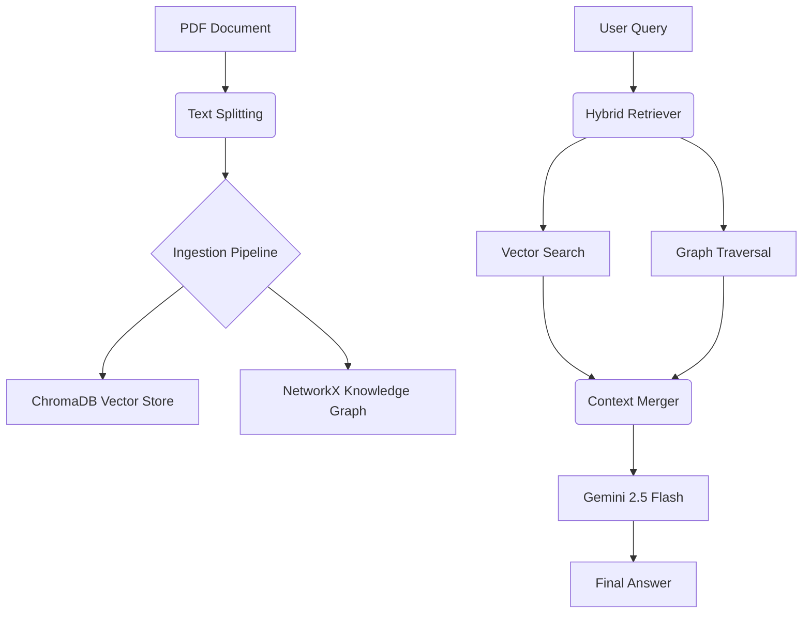

# Hybrid RAG (Vector + Knowledge Graph)

A high-performance Retrieval-Augmented Generation (RAG) system that combines the semantic power of **Vector Databases** with the structural precision of **Knowledge Graphs**. Powered by Google's Gemini models.

## 🚀 Overview

Standard RAG systems often struggle with complex queries that require connecting distant pieces of information or understanding structured relationships. **Hybrid RAG** solves this by:
1. **Vector Retrieval**: Capturing semantic meaning and context using ChromaDB.
2. **Graph Retrieval**: Traversing entities and relationships using NetworkX to find structured facts.
3. **Context Fusion**: Merging both sources into a unified, high-fidelity prompt for the LLM.

## 🏗️ Architecture



## ✨ Key Features

- **Multi-Modal Context**: Ingests PDFs and extracts both text chunks and entity-relationship triples.
- **Intelligent Graph Extraction**: Uses Gemini to automatically identify entities and relationships from text.
- **Hybrid Retrieval**: Simultaneously queries the vector store and traverses the knowledge graph for related facts.
- **Structured Fusion**: Merges context using XML-like tags to help the LLM distinguish between semantic and factual data.
- **Modern Stack**: Built with `google-genai`, `chromadb`, `networkx`, and `langchain`.

## 🛠️ Tech Stack

- **LLM**: Google Gemini 2.5/1.5 Flash
- **Vector DB**: ChromaDB
- **Knowledge Graph**: NetworkX
- **Embeddings**: Sentence-Transformers (`all-MiniLM-L6-v2`)
- **Orchestration**: LangChain (Document Loaders & Splitters)
- **UI**: Rich (Console logging)

## 📋 Prerequisites

- Python 3.11+
- Google AI Studio API Key (Gemini)

## ⚙️ Installation

1. **Clone the repository**:
   ```bash
   git clone https://github.com/ahmedjaved-hub/Hybrid-rag.git
   cd Hybrid-rag
   ```

2. **Set up the virtual environment**:
   ```bash
   # Using uv (recommended)
   uv venv
   .venv\Scripts\activate

   # Or using standard venv
   python -m venv venv
   source venv/bin/activate  # On Windows: venv\Scripts\activate
   ```

3. **Install dependencies**:
   ```bash
   pip install -r requirements.txt
   # Or using uv
   uv sync
   ```

4. **Configure Environment Variables**:
   Create a `.env` file in the root directory:
   ```env
   GEMINI_API_KEY=your_api_key_here
   ```

## 🚀 Usage

Currently, the main logic resides in `vector_store.py`. You can run the interactive query loop:

```bash
python vector_store.py
```

1. The system will load the sample PDF.
2. It will extract chunks and build the knowledge graph.
3. You will be prompted to enter a query.
4. The system will return a synthesized answer based on both vector and graph context.

## 📁 Project Structure

- `vector_store.py`: Core RAG logic (Ingestion, Retrieval, Merging).
- `main.py`: Entry point for the application.
- `samples/`: Directory for input PDF documents.
- `.env`: Sensitive configuration (ignored by git).
- `pyproject.toml`: Project metadata and dependencies.

## 🤝 Contributing

Contributions are welcome! Please feel free to submit a Pull Request.

## 📄 License

This project is licensed under the MIT License - see the LICENSE file for details.
